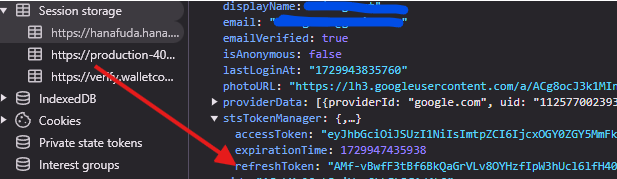

# Auto Deposit ETH for HANA Network / Auto Grow and Open Garden 


## Description
**Support Multi Account**
- Register here : https://hanafuda.hana.network/dashboard
- Regist with Google
- Submit Code
  ```
  0RNPYL
  ```
- Deposit $1 to ETH BASE, just not too much.
- Make 5,000 transactions to earn 300/hour (to unlock cards and get points).
- Make 10,000 transactions to earn 643 Garden Rewards boxes (to unlock collection cards).

**If you have unlock collection cards end script**

## Instalation
```bash
git clone https://github.com/Fxyt/hanabot.git
cd hanabot
```
install the packages
```bash
pip install -r requirements.txt
```
**Edit pvkey.txt and input Private Key**
```bash
nano pvkey.txt
```
create screen (optional)
```bash
screen -S hanabot
```
run the script
```bash
python3 bot.py
```
detach the screen 
```bash
ctrl a + d
```
view activity in screen
```bash
screen -r hanabot
```

**choose 1 to do transactions**
## Run grow and open garden boxes

**First You Need To Get Your Refresh Token**
- Open Hana Dashboard : https://hanafuda.hana.network/dashboard
- Click F12 to open console
- Find Application and choose session storage
- Select hana and copy your refreshToken

- Edit token.txt paste your refresh token

